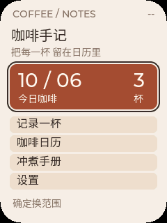

[English](README.md) · **简体中文**

# CoffeeNotes 咖啡手记

随身咖啡日历与手冲参考。用几个按键记下喝了什么咖啡，按日期回看每一杯，
把可调整的冲煮参数、分段注水提示与计时放在手边。



图片为使用实际界面完成的主机渲染，包含演示记录，不是实机照片或个人咖啡数据。

## 快速上手

1. 上/下选择，确定进入，长按确定返回或取消。首页从“记录一杯”按上选中统计卡片，
   确定切换今日、本周、本月咖啡；本周按周一至周日计算。
2. 首次进入 **设置 → 配置 Wi-Fi** 并按确定。手机连接屏幕显示的
   **CoffeeNotes-xxxx** 热点，使用屏幕上的密码，即使提示无互联网也保持连接。
   浏览器打开 **http://192.168.4.1**，填写 **2.4 GHz Wi-Fi** 名称和密码，点击
   **测试并保存**。设备显示 **已同步北京时间** 即就绪；失败或热点超时后按确定重试，
   换网时重新填写。
3. 进入 **记录一杯**，上/下选类型，确定保存；在 **咖啡日历** 选日期并确定查看。
   离线可记录；断电后未校时需在 **设置 → 手动调整日期** 确认日期。
4. **冲煮手册** 选配方，可调整参数或开始计时。确定暂停/继续，上键完成，再确定保存
   记录；长按确定取消。记录断电保留，下次开机自动重连。

5. **设置 → 配色风格** 提供咖啡棕、抹茶绿、海盐蓝、深夜黑。上/下预览，确定保存，
   长按确定取消；统计范围和配色会随记录保存。日历用 0、1、2、3+ 杯四档深浅色，
   选中日期用描边。

界面使用简体中文。支持六类咖啡、三种可调整的参考配方及最多 512 条记录。
没有豆名输入、云端账户或计时声音提醒。记录已满时，需要明确删除旧记录后才能新增。
60 秒无操作自动熄屏，冲煮（含暂停）和配网期间保持亮屏；第一次按键只唤醒屏幕。

## 构建与固件

这是复用上游 [AI Passport BSP](https://gitee.com/FoloToy/ai-passport) 的完整项目。
激活 **ESP-IDF 5.5.3**，环境准备见
[环境搭建](docs/development/engineering/environment-setup.zh_CN.md)。

```sh
python3 tools/install_passport_skills.py --install
./tools/validate.sh
```

完整验证生成 `build/FoloToy-AI-Passport-full.bin`，可从 **0x0** 刷写；匹配的 ELF/MAP
保存在 `build/firmware/<sha256>/`。合并刷写可能重置已有咖啡记录和 Wi-Fi 设置。
应用单独镜像不能从 0x0 刷写。

已实测 1.1 版镜像 SHA-256：
`f3b1c4b233243175402702dd31af683aa58bd37a39994891590b111c855be428`。
其内嵌构建版本为 `ccad39b-dirty`，诊断应使用该哈希绑定的 ELF。
发布使用的就是此次实机验收镜像，后续源码提交不会改变该文件。
固件二进制、调试文件和本地发布凭据不进入 Git。

## 验证与文档

- Build：**PASS**，完整构建、合并布局与归档核验通过。
- Host tests：**PASS**，模型/表单/存储/网络故障测试及实际界面/字体渲染通过。
- Device tests：**已观察项目 PASS**：分段刷写/启动核验，以及用户确认的自动熄屏/唤醒、
  冲煮运行/暂停保持亮屏、配色预览文字清楚、统计切换及配色/范围断电保存。
  首版网络/记录观察仍保留在历史实测记录。
- Unverified：全部页面显示/按键、实机有记录时的日历色阶、计时后保存记录、
  删除及配方参数保存、持续联网内存余量。

详见[使用说明与实测记录](docs/apps/coffeenotes.zh_CN.md)、
[实现计划](docs/superpowers/plans/2026-10-06-coffeenotes.zh_CN.md)、
[界面优化计划](docs/superpowers/plans/2026-10-06-coffeenotes-ui.zh_CN.md)及
[上游文档索引](docs/README.zh_CN.md)。

代码遵循仓库的 [MIT 许可证](LICENSE)，重命名的字体子集使用
[SIL Open Font License](assets/fonts/OFL.txt)。素材来源见
[assets/README.zh_CN.md](assets/README.zh_CN.md)。
